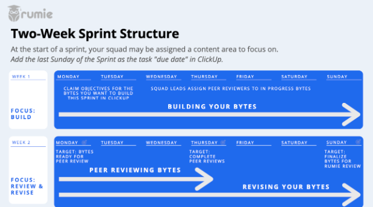

Rumie ByteGuide: Byte Authoring 
=================================================================

Created by Manav Chugh on Sep 17, 2020 The Rumie Initiative

## About Bytes

* Bytes are **microlearning experiences**, less than 10 minutes long
* Each Byte has one learning objective
* Bytes focus on **applying the concept** in a real-world context

## Content Guidelines

We create Bytes primarily on soft life and career skills that orient on the action. **Soft skills** are non-technical abilities that relate to how we work and interact with others. _For example: teamwork, communication, and adaptability._

| **Category**  |   |   |   |   |   |   |   
|---------------------------|---|---|---|---|---|---|
|  **Career Skills**   "I want to be more employable."  | **Learning to Learn**   "I want to take ownership of my personal development." | **Business Acumen**   "I want to better navigate business structures."   | **Innovation**   "I want to be prepared for whatever the future might hold."  | **Digital Literacy**   "I want to be an informed digital citizen." |  **Health***   "I want to contribute to a healthy community." | **Civics***   "I want to be an informed global citizen."  |   
|  **Example Topics & Themes** |   |   |   |   |   |   |   
| Teamwork → Constructive Conflict, Cultural Awareness  |  Finding Resources → Mentorship, Personal Learning Networks. | Personal Finance → Tracking Expenses, Financial Planning   | Adaptability → Perseverance, Openness  | Information and Media Literacies → Evaluating Digital Information, Searching  | Physical Health → Sexual Health, Nutrition |  overnment → Voting, Law & Justice | |   
|  **Outcomes** |   |   |   |   |   |   |   
| Become more prepared to engage in modern workplaces (regardless of specific vocation)  | Become a self-directed learner. Take better advantage of learning opportunities everywhere.| Develop an entrepreneur's mindset and build foundational business knowledge. | Become more agile. Adapt to changing circumstances at work or in the world. | Build foundational knowledge and skills to act safely and appropriately online. |  *_Requested By NGO partner organizations_.Combat misinformation and build healthier habits.  |  *_Suggested by a volunteer group_.Spark civic awareness, engagement and activism. |    

## Learning Objectives (LOs)

_Training Session_[<u>recording</u>]() ,[<u>deck</u>](https://docs.google.com/presentation/d/1WcLQcp_Y0sc4J20KfFBYbePwLSNWM3O5NIMgsmmJoJQ/edit?usp=sharing) , and [<u>activity</u>]().

### LO Purpose

* LOs help _learners_ self identify appropriate content. It helps answer the question: will this be helpful to me? Is this the outcome I'm looking for?
* LOs help _Byte authors_ maintain focus, ensuring that all content is directly contributing to or 'laddering up' to the learning objective.

### LOs vs SMART Goals

LOs and SMART Goals both:

* Take a specific, narrow focus
* Are attainable within the learner's context
* Have an unambiguous timeline
* Can be measured

But, in contrast to SMART Goals, Byte LOs:

* Have only short term goals (what is attainable in 10 minutes or less?)
* Must only be measurable in theory (because we are not there to assess learner performance in person)

### Authoring Effective LOs

1. Confirm: _does it align with Rumie's_ [<u>content guidelines</u>](https://docs.google.com/document/d/1S9ceZKlI7ODSk-SCnVW022ErcSoJWgUdwVGrKNhjWSo/edit#heading=h.rq3dbcz1umxk) _?_
2. _Confirm: does it add something new to the Byte library?_

* There will be Bytes that cover similar content or overlap in some ways, and that's okay. But, we don't need to create Bytes that repeat what already exists.
* Check the existing Byte library on Rumie-Learn and objectives in ClickUp to confirm your idea is not duplicative.
* Your objective should add something unique or complement existing Bytes.

1. _Start the sentence with a Bloom's Taxonomy verb._

* If possible, aim for the "application" level.
* This anchors the content on an _observable action_ and avoids being just an information dump.

1. _Ensure it's Byte sized._

* Because Bytes are short learning bursts, we'll often break down a learning objective into multiple, smaller chunks.
* While it's possible to deliver a Byte that has a high-level overview of a complex topic, it won't allow you to go in detail with specific elements.  
_Example In Action_

_There is one Byte that overviews "SMART Goals," and also 5 individual Bytes that go into each of the letters in greater detail._

* Use a mind map to breakdown your objective into sub-components. If you can create three or more layers of branching, choose one of the lower branches to create an attainable and appropriately sized objective.

1. _Keep the language simple._

* Just like the content in Bytes themselves, we want to learn objectives to be clear and direct. Ask yourself: Would an 8th grader understand it?

## Learning Strategies

### Hook the Learner

* Use the Background Info section to pull learners in and pique their interest.
* Ask a provocative question, use a scenario, or share an impactful statistic.

_Example In Action_

Sample Learning Objective: Contrast customer- and competitor-centric organizations. 

* "What do Netflix, Amazon, and Uber have in common?They disrupted their industries by being customer-centric, instead of competitor-centric. 
By focusing on customer needs, they were able to highlight their competitors' shortfalls and gain market share.
  * Netflix didn't kill Blockbuster, the late fees did.
  * Amazon didn't kill some retailers, poor customer service did.
  * Uber didn't kill the taxi industry, limited access and fare control did." 

### Examples, examples, examples!

* Bytes are about tangible application, not theory.
* If you share an idea or concept, back it up with how it actually plays out in real life.
* Use multiple examples, include them as content steps, add them as multiple choice questions, make them into scenarios.

_Example In Action_

Sample Learning Objective: Track financial expenses.

* Define 'expenses,' then give examples like: the money you spend on rent, food, and clothing.

Sample Learning Objective: Use creative outlets to relieve stress.

* Define 'creative outlets' then give some examples like: drawing, writing, or cooking.

### Audio Clips

* Custom audio is a great way to demonstrate the specific concept you're teaching. It's a lot easier than hunting for an ultra-specific video on Youtube that may not exist.
* For maximum impact, pair audio with a multiple-choice question that prompts the learner to apply their learning.

_Example In Action_

Sample Learning Objective: deliver feedback constructively.

* Use text to introduce a scenario, like a boss giving feedback to an employee during a private meeting. Record an audio clip of the boss giving feedback imperfectly. Use a multiple-choice question to ask what opportunity the boss had to improve their feedback delivery.
* Use text to introduce a scenario of an individual who wants to give feedback to their coworker. Record two audio clips for how they could deliver the feedback. Use a multiple-choice question to ask which option would be a more constructive way to deliver feedback.

### Multiple Choice Questions

* The best multiple-choice questions nudge learners to make an active decision and apply their learning, not just recall information. 
  - One way to do this is to present a brief scenario or example that has not already been shared. In the example, have the learner identify the next course of action, or how a situation could be handled better, etc.
* Try to make answers a similar length (otherwise, learners will usually guess the longest one)
* Try to make distractor answers plausible. Answers that obviously wrong make the question too easy. We want to make all options somewhat tempting.

_Example In Action_
Sample Learning Objective: Differentiate between fixed and variable expenses.
* After introducing the concept (likely with some examples), ask "Which of these is a variable expense?" Ensure all the responses are _new_ examples (i.e. not referenced immediately above).

_Example In Action_
Sample Learning Objective: Introduce yourself at a networking event.
* Introduce a scenario using text. E.g., the learner is at a networking event and has spotted someone they want to speak to. Ask "What would be a good icebreaker to say to this individual?" Make the variations of the response of what someone could say, demonstrating the points you've taught in the Byte, but _not_ explicitly replicating the above examples.

### Strong Takeaway Prompts

In the final "summary" step of your Byte, give the learner a prompt for something action-oriented they can do to apply their learning. This gives them the opportunity to extend their learning. You can think of it almost like you're assigning some light homework.

_Example In Action_
Sample Learning Objective: Take a collaborative approach to brainstorming.
* "This week, the next time you're faced with a problem, take the opportunity to brainstorm with your team. Set aside 30 minutes to sit together and...."
Sample Learning Objective: Create a visually attractive resume.
* "Over the next few days, look online to find at least 3 examples of resumes that look clean and professional. Use these samples as models to begin building your own polished resume."

## Writing Style

Terminology

* Write directly to our learners, it makes the tone warm and friendly. Use terms like "you," "our," and "we."
* When referring to a generic person whose gender is unknown or irrelevant to the context, use the singular "they" instead of "he/she."
* Try to keep your examples as **location agnostic** as possible. Choose examples and terminology with wide applicability. 
For example:
  - Say 'market' instead of 'grocery store'
  - Reference a 'coworker' but don't make a scenario explicitly in an office environment
  - Be cautious of mentioning something that might be culturally taboo (i.e. protesting, adultery, etc.)

### Simplify Writing

_Training Session_ [<u>recording</u>]() _,_ [<u>deck</u>]() _, and_ [<u>activity</u>]() _._

* To write simply, keep in mind the guiding principle: **first brevity, then clarity.** This means starting with the bare bones and adding supporting details/qualifying words to ensure your message is clear.
* Cut the jargon and use straight forward vocabulary. Re-read your Byte out loud to delete unnecessary words where possible. 
_Examples in Action:_
  - Say "is part of" instead of "contributes to"
  - Say "uses" instead of "utilizes"
  - Say "makes" instead of "generates"
* Choose to write in bullet points over paragraphs. Any 'x, y, and z,' list can easily become a bulleted list.
* Use an active voice. This means putting the subject (actor) at the beginning of the sentence. Or use the imperative if the subject would be "you."

_Example in Action:_  
Don't say: "Follow-up emails are sent by successful candidates."  
Say: "Successful candidates send follow-up emails."  
Say: "Send a follow-up email."  
* Use shorter sentences. Instead of using multiple commas, semicolons, or dashes, break one sentence into separate chunks. Connecting words like _however, therefore, additionally, moreover,_ are also clues to break up your sentence.
* Use affirmative language. This means pointing out what people _should_do instead of negations.

_Example in Action:_  
Don't say: "Don't leave your shoes on when you enter the house."  
Say: "Take your shoes off when you enter the house."  

## Peer Review

_Consider these points as you complete a peer review of a Byte._

| | |
| ---- | ---- | 
| **Learning Effectiveness** | * Does the Byte fulfill the stated objective?   * Is the content ordered in a logical way? (I.e. big picture before supporting details?) |
| **Writing** | * Is the language simple and approachable? (Can I remove any jargon?)   * Is the language action-oriented (i.e. "Do this" vs. "One would do this")?   * Is the writing concise and direct (is there any filler that can be removed without compromising the message?)   * Does the writing flow well from one point to the next? (Do transitions smoothly connect the points?)  |
| **Format** | * Does the formatting look clean and consistent?   * Does the imagery complement the writing?   * Is this learning experience shorter than 10 minutes? _(i.e. When I read it through to digest the information, watch all media, and engage with questions, the total seat time should be ~10 minutes or less. **Consider your reading speed in this assessment. If you're a slow reader, allow yourself ~15 minutes per Byte. If you're a fast reader, allow yourself ~5 minutes per Byte.**)_ |
| **Engagement** | * Is there at least one multiple-choice question?     * Does it require the learner to apply their learning? (vs. simple recall/memorization)   * Is there at least one instance of audio or video? |

# Learning Design Team Workflow

## Team Structure

* The Learning Design Team is broken down into squads.
* Each squad has a lead who is the first point of contact for troubleshooting and answering questions for team members.
* Squad leads are responsible for assigning peer reviewers within the squad each sprint.
* Squads will be shuffled every few months.

## Sprints

The Learning Design team follows a 14-day sprint structure, outlined below.

* Sprint content areas will be communicated via Slack prior to the start of each sprint.
* The sprint is a guide but not hard deadlines. If you are delayed or need more time, communicate this with your squad lead via slack.
Occasionally, we will take a week between sprints as a "Catch-Up and Learning Objectives" week.
* This week is intended as an opportunity for all team members to tie up any outstanding loose ends, author, and review learning objectives on the topic of focus.   

## Rumie-Build

* Bytes are built-in Rumie-Build.
* Upon completion of onboarding, Learning Designers will be emailed a link to access Rumie-Build.
  - The first time Learning Designers access the link, they will be prompted to create a profile. This includes an avatar, fun facts, as well as opportunities to add a bio and link externally to their online presence.
  - Learning Designers will use the same link to build all of their Bytes.
  - Rumie-Build will keep you automatically logged in at the end of your session. (Don't click "Log Out" unless you are on a public computer.)

## ClickUp

_ClickUp Introductory_ [<u>video</u>](https://www.youtube.com/watch?v=DRCy2WSjTd8&feature=youtu.be&ab_channel=SamZimmer)

* Byte status' are tracked in ClickUp.
* Upon completion of onboarding, Learning Designers will receive an invitation to join ClickUp. 
  - Unfortunately, this will come as multiple emails for each of the content topics. Fortunately, it only happens once!

### Statuses

_ClickUp Process_ [<u>video</u>](https://youtu.be/2q5Rx1wPpuY)

As you move through the sprint process (authoring, peer review, and revision,) you will update the status of your Byte in ClickUp. The statuses are:

|  |  |
| --- | --- |
| Objective Idea | * This is your objective 'brainstorm.' It may not be fully formed yet.   * Change status when you are satisfied with the objective and have checked it against the [<u>guidelines.</u>](https://docs.google.com/document/d/1S9ceZKlI7ODSk-SCnVW022ErcSoJWgUdwVGrKNhjWSo/edit#heading=h.e6bgk9la8ngz)   |
| The objective for Peer Review | * This is an objective that is ready for the second set of eyes.   * Reviewers, consider the objective in the context of the [<u>guidelines</u>](https://docs.google.com/document/d/1S9ceZKlI7ODSk-SCnVW022ErcSoJWgUdwVGrKNhjWSo/edit#heading=h.e6bgk9la8ngz).   * Make changes directly to the LO, or @tag the author with comments.   * Once the reviewer 'blesses' the objective, the reviewer changes the status.   |
| Ready to Build | * This is an objective that has been peer-reviewed and is ready to be built into a Byte.   * Ready to Build objectives are considered 'up for grabs' until/unless someone has claimed it by making themself the 'assignee.'   * Once you claim an objective (by making yourself the "assignee" at the start of a sprint), change the status.   |
| Build-in Progress | * This indicates that you are currently working on your first draft of the Byte.   * Add the Byte URL from Rumie-Build.   * Change the status when you have completed your first draft of the Byte (at the end of week 1 of the sprint).  |
| Byte for Peer Review | * This indicates that the Byte draft is complete and ready for peer review.   * Peer reviewers may review in any order using the [<u>Peer Review Checklist</u>](https://docs.google.com/document/d/1S9ceZKlI7ODSk-SCnVW022ErcSoJWgUdwVGrKNhjWSo/edit#heading=h.381elfqk3uxf).   * Peer reviewers make comments either by commenting on the task within ClickUp or by leaving comments directly in the Byte using the comments feature.   * After giving comments, the first person to peer review changes the status. |
| Byte for Peer Review 2 | * This indicates that the Byte draft has received one set of peer review comments.   * Peer reviewers may review in any order using the [<u>Peer Review Checklist</u>](https://docs.google.com/document/d/1S9ceZKlI7ODSk-SCnVW022ErcSoJWgUdwVGrKNhjWSo/edit#heading=h.381elfqk3uxf).   * Peer reviewers make comments either by commenting on the task within ClickUp or by leaving comments directly in the Byte using the comments feature.   * After giving comments, the second person to peer review changes the status.   |
| Revisions in Progress | * This indicates that you are incorporating peer review feedback to finalize your Byte.   * After finalizing, click "Publish" in Rumie Build. - Select a cover photo - Retitle the Byte (using Title Case) - Categorize according to category/topic/theme - Select appropriate timing   * Change the Byte status after publishing.   |
| Byte for Rumie Review | * This indicates that the Byte is ready for Rumie review/approval.   * Rumie will review the Byte in correspondence with the [<u>Approval Guidelines.</u>](https://docs.google.com/document/d/1S9ceZKlI7ODSk-SCnVW022ErcSoJWgUdwVGrKNhjWSo/edit#heading=h.giyd5nuwn271)   * Rumie will change the status after approving the Byte.   |
| Byte Published | * This indicates that the Byte is live on Rumie-Learn.   |

### Dashboards

* Access your dashboards by clicking the icon on the left-hand side (below the bell icon).
* You will have access to two dashboards: individual and squad. 
  - The individual dashboard shows Bytes currently assigned to you. 
It also has:
    + Events calendar
    + Links to additional resources
    + Total team metrics (# of Bytes at each status).
  - The squad dashboard shows Bytes currently assigned to your team.

# Approval Guidelines

## Acknowledgement

Rumie is a learning technology nonprofit organization, located in Toronto, Canada, that facilitates the authoring and free dissemination of microlearning courses called Bytes. Rumie provides the tools and a platform for volunteers to build Bytes covering a broad range of topics, based on their skills and expertise. We acknowledge the inherent cultural, linguistic, and geographic biases present in our own organization and core author community. As a small organization, we try our best to guide contributions that are culturally sensitive and aware.

## Standards

Rumie will not post authored content that:

1. may create a risk of harm, loss, physical or mental injury, emotional distress, death, disability, disfigurement, or physical or mental illness to you, to any other person, or to any animal;
2. may create a risk of any other loss or damage to any person or property;
3. seeks to harm or exploit children by exposing them to inappropriate content, asking for personally identifiable details or otherwise;
4. may constitute or contribute to a crime or tort;
5. contains any information or content that we deem to be unlawful, harmful, abusive, racially or ethnically offensive, defamatory, infringing, invasive of personal privacy or publicity rights, harassing, humiliating to other people (publicly or otherwise), libellous, threatening, profane, obscene, or otherwise objectionable;
6. contains any information or content that is illegal (including, without limitation, the disclosure of insider information under securities law or of another party's trade secrets);
7. contains any information or content that you do not have a right to make available under any law or under contractual or fiduciary relationships; or
8. contains any information or content that you know is not correct and current.
9. may not publish or post other people's private information (such as home phone number and address) without their express authorization and permission.
10. may not violate others' intellectual property rights, including copyright and trademark.

## Proofing

Before publishing any Bytes publicly, Rumie reviews Bytes for the following elements:

* Correct spelling and grammar
* Appropriate formatting
* Sufficient attribution (facts and external imagery are accompanied by a source as needed)
* Appropriate categorization under related category/topic/theme
* Appropriate timing selection (3/6/9 min)

## Tagging

Tags are small keywords that you attach to your Byte. Tags act like labels to tell users what the content is about.

If Rumie-Learn is like a gigantic book, tags are what make up the **index**. They let learners browse and find the content that is most relevant to them, without reading everything cover to cover. 

### Tags vs. Categories

If tags are like the index, categories are like the chapters listed in the table of contents at the start. They're the big buckets that Rumie-Learn is made of.

In general, categories are longer than tags (a few words rather than just one or two keywords) and you'll have fewer of them.

* Tags are short and specific, typically 1-2 words.
* Categories tend to be longer and more general.
* Your categories are like your table of contents, and your tags are like your index.
* Categories are hierarchical and required. Tags are not.

### Tagging Areas

#### UN Sustainable Development Goals (SDGs)

Byte content relates or contributes to one/more SDGs:

* sdg1nopoverty
* sdg2zerohunger
* Sdg3goodhealth
* sdg4qualityeducation
* sdg5genderequality
* Sdg6cleanwater
* sdg7cleanenergy
* sdg8decentwork
* sdg9industry
* sdg10reducedinequality
* sdg11sustainablecities
* sdg12responsibleconsumption
* Sdg13climateaction
* sdg14lifebelowwater
* Sdg15lifeonland
* sdg16peaceandjustice
* Sdg17partnership 

#### Geotagging

Content is only relevant or appropriate in certain regions. E.g., northamerica, Afghanistan, USA, Canada, Toronto, new york city, Barcelona etc. 

#### Learner Intent

Is the learner uncovering a problem or a solution?

* **problem aware: the learner is seeking to understand a challenge or its causes*

E.g.,[<u>Identifying Bullying in Different Settings</u>](https://learn.rumie.org/jR/bytes/identifying-bullying-in-different-settings/view)

* **solution aware: the learner is exploring possible solutions to address the challenge*

E.g., [<u>Responding to Bullying</u>](https://learn.rumie.org/jR/bytes/responding-to-bullying/view)

#### Trends

Focus on trends and fluid topics. Trends are topical (may be highly relevant now, and less relevant in 12 months) in contrast to categories (which are likely to be equally relevant today and in 12 months).

Examples might include: 

* covid19
* remote work
* election
* virtual reality
* fake news
* influencer

Document generated on Sep 17, 2020 11:26

